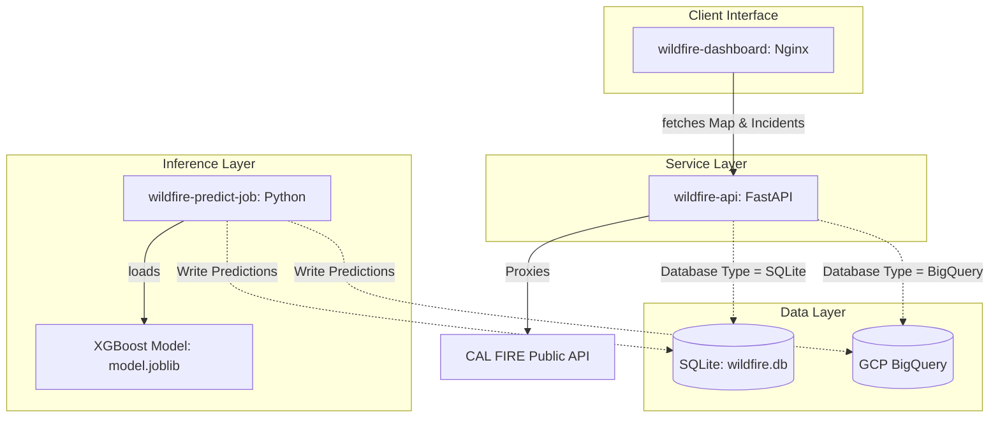

# Wildfire Risk Forecasting Dashboard

A cloud-native, geospatial interface designed to monitor real-time active fire events and predict regional wildfire risk using machine learning.

This project is built with a **Dual-Mode Adapter Architecture**, enabling it to run either as a fully serverless system on **Google Cloud Platform (GCP)** or as a **fully offline, containerized local system**—making it highly portable for development.

---

## 🏗️ Architecture Overview

The system consists of three main components:
1. **Dashboard (Frontend)**: Served via Nginx, utilizing the Google Maps JavaScript API for interactive spatial rendering.
2. **API Backend**: Built with FastAPI, exposing real-time active fires (CAL FIRE API proxy) and predictive analytics.
3. **ML Prediction Job**: A Python batch job that loads a pre-trained XGBoost model (`model.joblib`), simulates weather and geographic features, calculates wildfire risk, and writes results back to the database.

### 📐 System Design Diagram



---

## ⚡ Quick Start: Running Locally (100% Offline)

Ensure you have [Docker](https://www.docker.com/) installed.

### 1. Start the API and Dashboard
From the root directory, spin up the Docker containers:
```bash
docker-compose up
```

Once started:
* 🌐 **Dashboard**: Access at [http://localhost:8080](http://localhost:8080)
* ⚙️ **API Swagger docs**: View at [http://localhost:8000/docs](http://localhost:8000/docs)
* 🗄️ **Database**: Automatically created and seeded as a local SQLite database (`data/wildfire.db`) with grid cells and initial mock predictions.

### 2. Run the ML Prediction Job
To trigger the machine learning model to simulate weather features, predict risk, and write new predictions to your local database:
```bash
docker-compose run --rm wildfire-predict-job
```
*Note: This command runs the batch container, performs local XGBoost inference on the grids, updates `wildfire.db`, and terminates.*

---

## ☁️ Google Cloud Platform (GCP) Deployment

This system is optimized to run on GCP for **$0.00/month** by using serverless products and avoiding costly 24/7 VMs.

### Zero-Cost Cloud Optimization
* **Cloud Run (API & Dashboard)**: Deployed as serverless containers. Free tier includes 2 million requests/month.
* **BigQuery (Database)**: Holds grid cells and prediction history. Free tier includes 10 GB of storage and 1 TB of query processing/month.
* **Vertex AI Endpoint Bypass**: Standard deployments host models on Vertex AI Endpoints, which require a VM running 24/7 (costing **$70 - $140/month**). This project bypasses this cost by loading the XGBoost model (`model.joblib`) directly inside the Cloud Run container/job using Python's `joblib`. This achieves serverless CPU inference for **$0/month**.

### Deployment Commands

#### 1. Setup BigQuery
Create a dataset `wildfire_mvp` and two tables:
* `grid_cells`: Columns `grid_id` (STRING), `center_lat` (FLOAT), `center_lon` (FLOAT).
* `predictions`: Matching the local schema.

#### 2. Build & Push Docker Containers to Artifact Registry
```bash
# Authenticate
gcloud auth configure-docker us-west1-docker.pkg.dev

# Build & Push API
docker build -t us-west1-docker.pkg.dev/[PROJECT_ID]/wildfire/api:latest ./wildfire-api
docker push us-west1-docker.pkg.dev/[PROJECT_ID]/wildfire/api:latest

# Build & Push Dashboard
docker build -t us-west1-docker.pkg.dev/[PROJECT_ID]/wildfire/dashboard:latest ./wildfire-dashboard
docker push us-west1-docker.pkg.dev/[PROJECT_ID]/wildfire/dashboard:latest
```

#### 3. Deploy to Cloud Run
```bash
# Deploy API
gcloud run deploy wildfire-api \
  --image us-west1-docker.pkg.dev/[PROJECT_ID]/wildfire/api:latest \
  --platform managed \
  --region us-west1 \
  --allow-unauthenticated \
  --set-env-vars DATABASE_TYPE=bigquery,PROJECT_ID=[PROJECT_ID]

# Deploy Dashboard (Configure your client dashboard app.js API_BASE to point to the newly created API URL)
gcloud run deploy wildfire-dashboard \
  --image us-west1-docker.pkg.dev/[PROJECT_ID]/wildfire/dashboard:latest \
  --platform managed \
  --region us-west1 \
  --allow-unauthenticated
```

